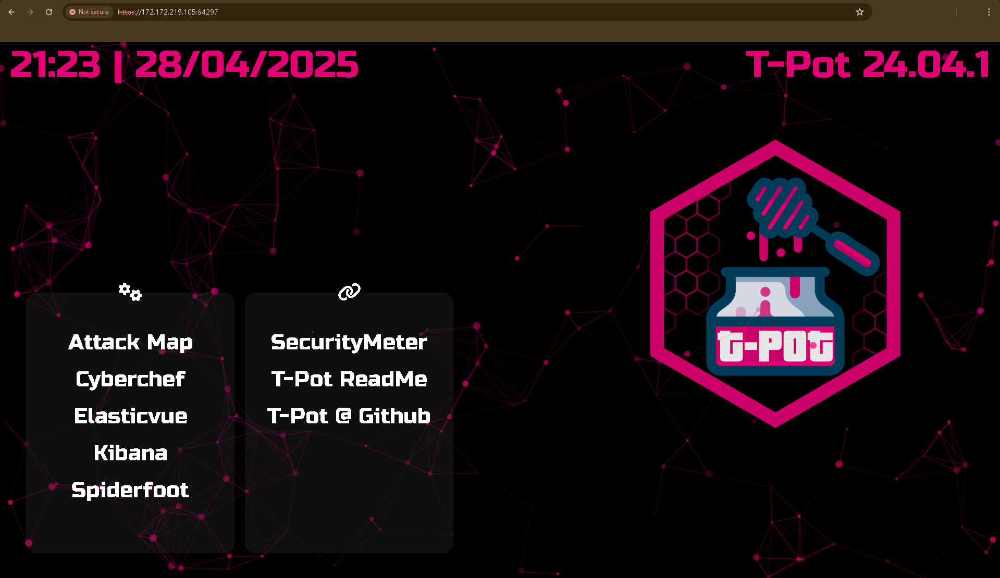
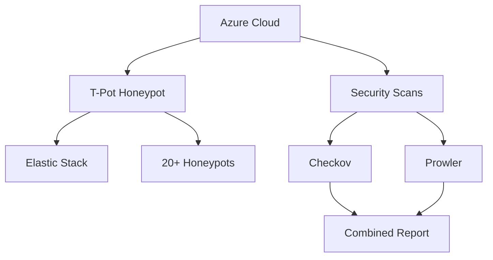
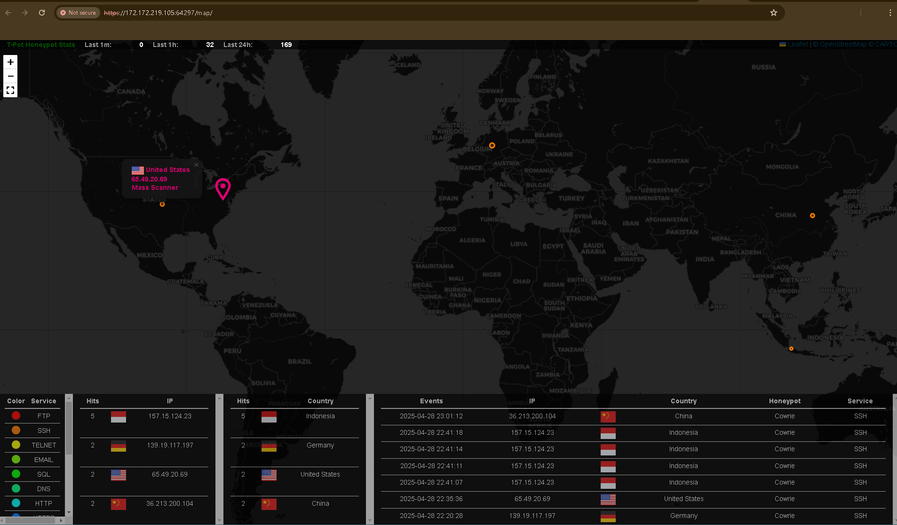
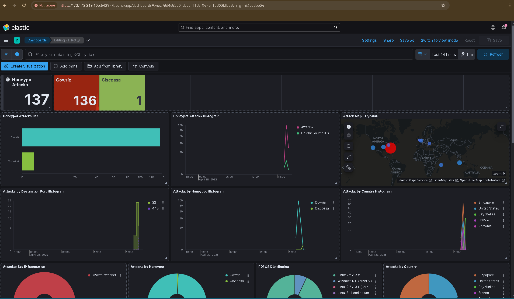
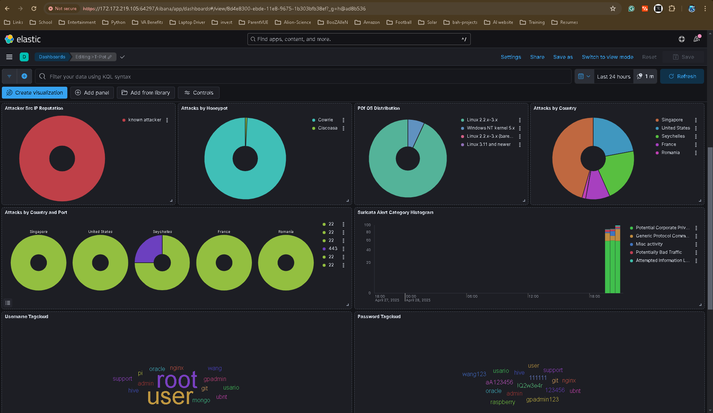
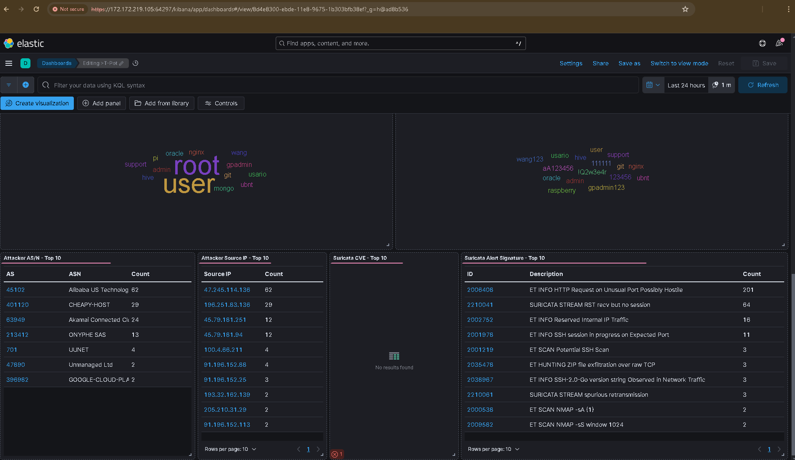
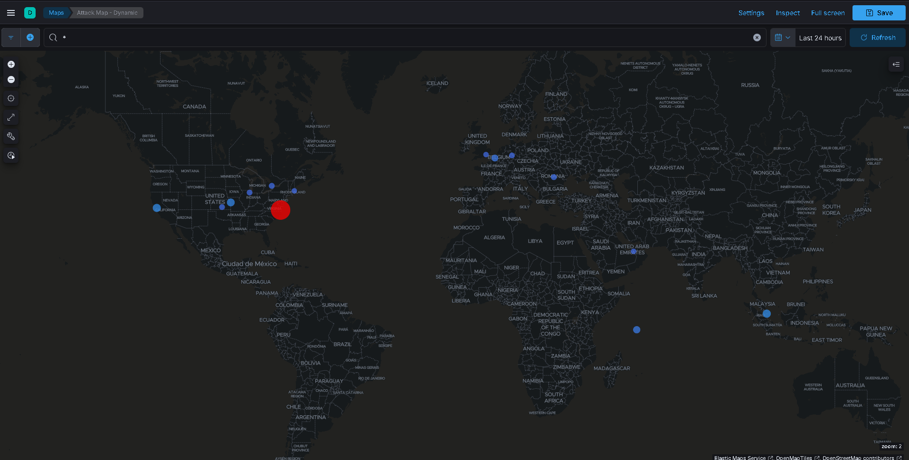

# ⚔️ Azure Honeynet Lab with T-Pot & Security Scanning

## 📝 Overview

This lab automates the deployment of a security-focused environment in Azure featuring:

- **T-Pot Honeypot**: Multi-architecture platform with 20+ honeypots and Elastic Stack for attack visualization.
- **Infrastructure as Code**: Automated provisioning using Terraform.
- **Security Scanning**: Integration with Checkov (IaC misconfiguration) and Prowler (cloud config audit).
- **Automated Reporting**: Generates combined PDF and Markdown security reports.

  


---

## 🛠️ Prerequisites

Before deploying, ensure you have:

- ✅ Azure account with active [subscription](https://azure.microsoft.com/en-us/pricing/purchase-options/azure-account?icid=azurefreeaccount) 
- ✅ [Azure CLI](https://learn.microsoft.com/en-us/cli/azure/install-azure-cli) installed  
- ✅ [Terraform](https://developer.hashicorp.com/terraform/downloads) v1.0+  
- ✅ Python 3 with pip  
- ✅ [Docker](https://www.docker.com/) (optional but recommended)  
- ✅ [T-Pot - The All In One Multi Honeypot Platform](https://github.com/telekom-security/tpotce) (Deutsche Telekom Security GmbH Github)
---

## 🚀 Deployment Steps

### 1️⃣ Infrastructure Deployment

```bash
cd terraform
terraform init
terraform apply  # Confirm with 'yes'
```

**Creates**:  
- Resource group  
- Virtual network  
- Ubuntu VM with public IP  
- NSG rules to expose T-Pot  

---

### 2️⃣ Install T-Pot on VM

```bash
ssh azureuser@$(terraform output -raw public_ip)
wget https://github.com/telekom-security/tpotce/raw/master/install.sh -O tpot-install.sh
chmod +x tpot-install.sh
./tpot-install.sh
```

🔘 *Choose "Hive" installation type when prompted.*

🔘 *Complete the installation and set up the web username and password, once complete restart the VM*

---

### 3️⃣ Security Scanning

#### ✅ Run Checkov (IaC Scan)
```bash
./scripts/run_checkov.sh
```
*Scans Terraform for security issues.*

#### ✅ Run Prowler (Cloud Config Scan)
```bash
./scripts/run_prowler.sh
```
*Audits live Azure environment against CIS benchmarks.*

---

### 4️⃣ Generate Combined Report

```bash
python3 scripts/generate_report.py
```

📁 Outputs to: `outputs/reports/security_report.{md,pdf}`

---

## 🧰 Key Directory Structure

```
.
├── terraform/               # Terraform IaC
│   ├── main.tf
│   ├── variables.tf
│   └── outputs.tf
├── scripts/
│   ├── run_checkov.sh       # IaC scanner
│   ├── run_prowler.sh       # Azure scanner
│   └── generate_report.py   # Combines results
│   └── install_hnetx        # HoneyNetX installation script 
└── outputs/
    ├── checkov/             # Checkov output
    ├── prowler/             # Prowler output
    └── reports/             # Final reports
```

---

## ⚠️ Common Issues & Fixes

### ❌ T-Pot Install Hangs or UI Not Available

**Fix**:
```bash
sudo systemctl restart docker
sudo docker-compose -f /opt/tpot/etc/tpot.yml up -d
```

### ❌ Checkov or Prowler Errors

**Python Dependencies**:
```bash
python3 -m venv venv
source venv/bin/activate
pip install -r requirements.txt
```

**Checkov via Docker**:
```bash
docker run --rm -v $(pwd):/src bridgecrew/checkov -d /src
```

### ❌ Azure Authentication Errors

**Fix**:
```bash
az login
az account set --subscription YOUR_SUB_ID
export ARM_CLIENT_ID="..."
export ARM_CLIENT_SECRET="..."
export ARM_TENANT_ID="..."
```

---

## 🔐 Security Recommendations

- 🔒 Change default SSH credentials immediately
- 🌐 Restrict NSG inbound IP ranges post-deployment
- 🛡️ Enable Microsoft Defender for Cloud

📡 **Monitor T-Pot Logs**:
```bash
ssh -p 64295 azureuser@VM_IP "sudo docker logs tpot"
```

🧼 **Update T-Pot Regularly**:
```bash
ssh -p 64295 azureuser@VM_IP "sudo tpotctl update"
```

---

## 🏗️ Lab Architecture



---

## 🧹 Cleanup

```bash
terraform destroy
# Double-check in Azure Portal for leftover resources
```

---

## 📸 Screenshots
  
*Real-time attack visualization.*

*Kibana Dashboard.*



*Kibana attack map.*

  

*Example output from automated scanning.*

---

## 🎓 About

This lab offers a practical introduction to cloud-based honeypots, real-time monitoring, and infrastructure security auditing. Use it to analyze real-world attacks and misconfigurations in a controlled environment.
